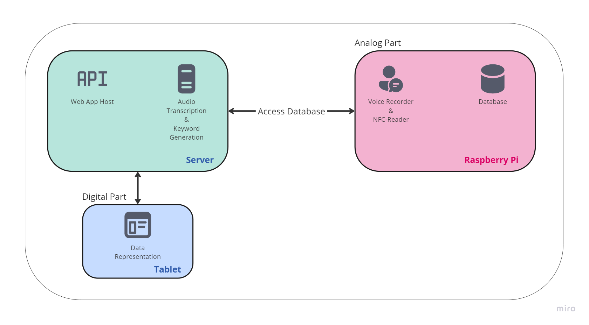
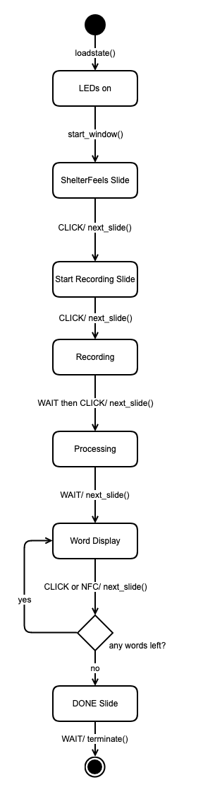
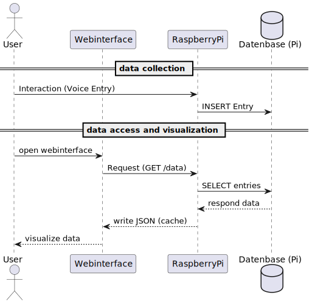

# ShelterFeels2.0

ShelterFeels 2.0 is an advanced iteration of the initial ShelterFeels project, originally developed during a collaborative workshop at the Freie Universität Berlin and the Kunsthochschule Berlin-Weißensee. The objective of this project is to design an interactive object that facilitates a deeper understanding of emotional states and encourages playful, consistent self-reflection. 

As part of the author’s Bachelor thesis, a web application was developed to enable long-term analysis of data collected by the ShelterFeels device. 

Files edited due Bachelorthesis: 
*shelterfeels\run.py *
*shelterfeels\server.py *
*shelterfeels\gui\main_window.py *
*shelterfeels\nfc_led\config.py *
*shelterfeels\nfc_led\nfc_led_connection.py *
*shelterfeels\voice_recognition_app\text_processing\key_word_extractor.py *

Files added due Bachelorthesis: 
*shelterfeels\database *
*shelterfeels\templates *
*shelterfeels\static *

# ShelterFeels

1. [ Description ](#Description)
   1. [ Hardware ](#Hardware)
   2. [ Components ](#Components)
   3. [ Workflow ](#Workflow)
2. [ Installation ](#Installation)
3. [ Usage ](#Usage)
4. [ Acknowledgements ](#Acknowledgements)
5. [ License ](#License)

## Description

This repository contains the software for an interactive object equipped with voice recognition and NFC tag reading functionalities + a database setup for visualizing the data on a web application. It features a graphical user interface and provides visual feedback using NeoPixel LEDs.

The directory emotriowheel contains early Arduino-based prototypes. The core functionality of the project is located within the shelterfeels directory.

### Hardware

- 2.8inch HDMI LCD (H) (SKU: 21316)
- Raspberry Pi 4 Model B (4GB RAM)
- PN532 NFC NXP RFID-Modul (supports I2C)
- iGOKU USB Mikrofon
- Neopixel LEDs

### Components

#### Recognition app

Located in the voice_recognition_app directory.

For audio processing, FFMPEG must be installed. Installation and setup instructions can be found at: https://ffmpeg.org/download.html. The application offers two processing modes: text summarization and keyword extraction, with the latter being more appropriate for the project’s scope.

Note: If the microphone has more than two channels, only the first two will be processed. In the case of mono microphones, channels are duplicated.

To improve performance, particularly when deployed on a Raspberry Pi, remote processing via a designated server (inference_remote) is available. The remote server URL and additional configuration parameters, including audio device specifications and model settings, can be defined within the configuration files.

#### GUI

Contained within the gui directory.

The GUI is built using Tkinter, which must be installed separately using: `sudo apt-get install python3-tk`

The interface is structured into individual “slides,” each implemented as a separate object with its own setup and logic. Styling configurations such as window size, background color, and fonts can be adjusted in style.py.

### NFC

Implemented in the nfc_led directory.

The NFC functionality utilizes the pn532 library to read RFID chips, which return unique identifiers. Although the identifier values themselves are not meaningful, their uniqueness allows for precise emotion tagging. Each chip is associated with one of six core emotions.

#### LED Feedback

Also located in the nfc_led directory.

Each core emotion is linked to a specific RGB color. The device uses seven rings of NeoPixel LEDs, one for each day of the week. The system dynamically updates the LED rings based on user input: with each new input, the corresponding LED ring is divided into segments representing recorded emotions throughout the day.

The configuration file in this directory allows adjustments to LED address settings, chip-to-emotion mappings, and other hardware-specific parameters.

### Database

Located in the database directory.

The database supports long-term data storage and retrieval. Each time a user links an emotion to a keyword, a new record is created for later visualization via the web application. The database resides on the Raspberry Pi and is accessed by the backend server.

### Webapp

Files related to the web interface are stored in the templates and static directories.

The web application is designed to visualize the data collected by the ShelterFeels device. It provides a detailed view of emotional entries on a dedicated Emotion Page, offering users insights into their overall emotional patterns. Additionally, it serves as an educational tool, offering explanations of the six core emotions used by ShelterFeels.

The application is built with FastAPI and Jinja templating, and is served via Uvicorn.

### Connectivity

The system uses a VPN connection provided by ZeroTier to ensure secure and stable communication between components.

Below is an overview of the system's connectivity:

### Workflow

The run.py script initializes the LED states from the last session and launches the graphical interface. The application's progression is controlled by the next_slide function of the main window object. Each slide operates with its own initialization and functionality routines.

A state diagram illustrating the operational flow of the ShelterFeels system is shown below:

A detailed UML sequence diagram illustrates the interaction between the user, the ShelterFeels device, and the web application:

## Installation

Due to the project's tight coupling with specific hardware components, installation may present challenges. It is strongly recommended to thoroughly review and understand the code before attempting to set up the system.

Requirements include Python 3.10 and additional packages listed in the requirements.txt file. Begin installation using the command:

`pip install -r requirments.txt` 

Additional manual steps may be necessary to resolve dependencies for certain packages.

To launch the application, execute:

`sudo python run.py`

## Usage

ShelterFeels is a tangible object designed to help individuals understand, reflect on, and communicate their emotions through physical interaction. It functions as a personal daily ritual, often used at the end of the day for self-reflection in a quiet, familiar space.
The interaction with ShelterFeels involves three main phases:
1. Voice Recording: Begin by interacting with the physical box. The device will prompt you with a question like "How has your day been?". You then speak to the object, describing the events of your day and situations where you felt emotionally engaged.
2. Emotion Tagging: After recording, the system presents spoken words extracted from your voice input. To process these, you use NFC emotion tokens, which represent various feelings based on Gloria Willcox's Feeling Wheel (e.g., joyful, sad, mad, scared, powerful, peaceful, and more nuanced emotions). You associate a token with a displayed word by placing it on the NFC reader of the box.
3. Immediate Visualization: Once tagged, the seven LED rings on the lid of the box light up in colors matching the emotions you assigned for each day, providing a visual overview of your emotional state over the past week.

For long-term reflection and deeper insights, ShelterFeels is complemented by a web application:
* Data Visualization: The web application allows you to visualize your collected emotional data over time, offering a broader perspective beyond the daily LED feedback. The main interface displays emotion circles and a polar area chart showing the distribution of emotions, while detailed pages show all tagged words for each core emotion.
* Emotional Vocabulary Learning: It also provides a dedicated section to learn about emotional vocabulary, explaining the feelings represented by the tokens and helping you expand your understanding of emotions.
The system securely stores your voice recordings and tagged emotions on a Raspberry Pi, and the web interface is hosted on a server, with ZeroTier ensuring secure communication between the devices.

## Acknowledgements

ShelterFeels was developed by Evelina Gudauskayte, Elisa Machmer, Philipp Schmidt, Gaith Adra, and Anna Fey Winkler as part of a collaborative initiative between the Freie Universität Berlin and Kunsthochschule Berlin-Weißensee.

The Bachelor thesis on ShelterFeels authored by Philipp Schmidt can be accessed at:

## License

ShelterFeels is open source as per [GNU General Public License v3.0](LICENSE)
